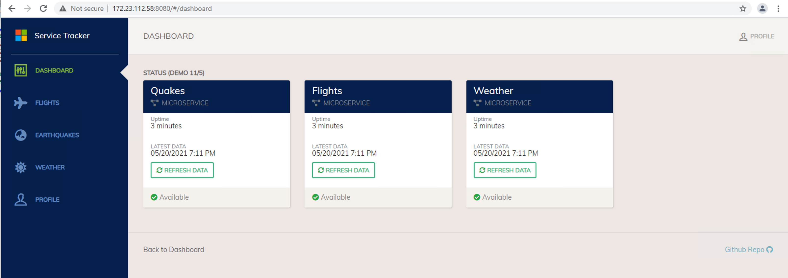
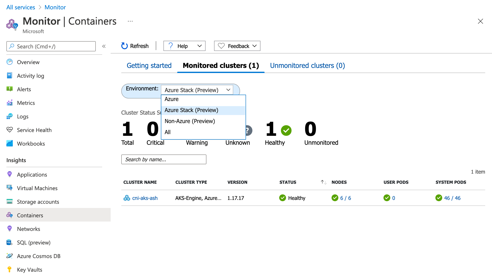
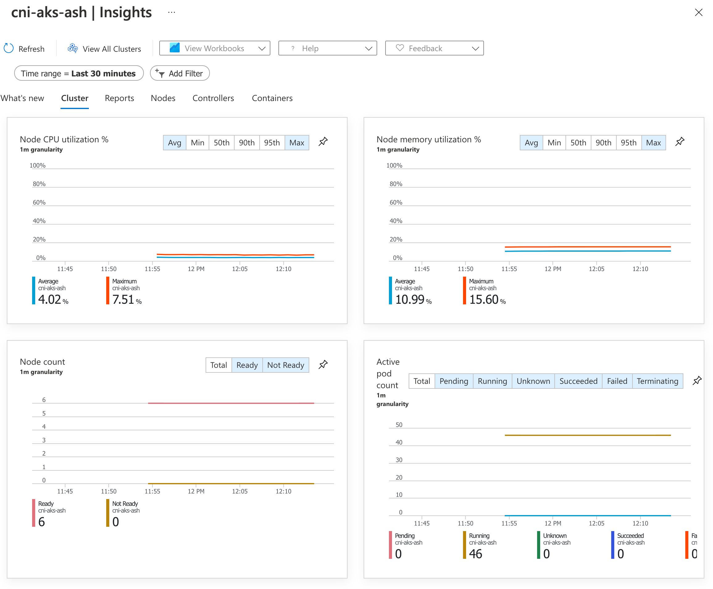

# AKS Engine on Azure Stack Hub - Best Practices

> **_NOTE:_** The purpose of this document is to provide a light weight guide to AKS on Azure Stack Hub deployment. The best, in depth, source for guidance is the [Azure Documentation](https://docs.microsoft.com/en-us/azure-stack/user/azure-stack-kubernetes-aks-engine-overview?view=azs-2008) which I used to create this summary content. Think of this content as the CliffsNotes™ version.

## Getting started

The first decision to make when looking to run Kubernetes on Azure Stack Hub (henceforth ASH) is to determine which approach you want to take for cluster lifecycle management (i.e. Cluster Create, Update, Scale, Delete). You have various options, including tools that target bare metal and virtual machine based deployments, like [k3s](https://k3s.io/). In this guide our focus will be on the Azure Native options:

* Azure Kubernetes Service Engine
* AKS Resource Provider for Azure Stack Hub 

As the AKS Resource provider is still in preview, we'll be focusing on the AKS Engine option for cluster lifecycle management.

---

## AKS Engine on ASH Support

AKS Engine is an open source project run by Microsoft, so it typically would not have standard support beyond the open source issue process. However, as a mechanism for running AKS on ASH there is support available. For the full details see the [support policy document](https://docs.microsoft.com/en-us/azure-stack/user/azure-stack-kubernetes-aks-engine-support?view=azs-2008) provided by the Azure Stack Hub team. 

---

## Pre-reqs: Getting ready to install AKS Engine on Azure Stack Hub

The Azure documentation is very thorough in providing the steps needed to install AKS on Azure Stack Hub, but lets highlight a few key points.

1. Review the prerequisites documented [here](https://docs.microsoft.com/en-us/azure-stack/user/azure-stack-kubernetes-aks-engine-set-up?view=azs-2008), which in summary tells you to confirm the following:

    * ASH is on version 1910 or later (See the AKS Engine to ASH version mapping [here](https://docs.microsoft.com/en-us/azure-stack/user/kubernetes-aks-engine-release-notes?view=azs-2008#aks-engine-and-azure-stack-version-mapping))
    * ASH has the Linux Custom Script Extension v2 installed from the Marketplace
    * Service Principal has been created with Contributor Rights on your target ASH Resource Group
    * An SSH private/public key pair is available, which you will pass in the public key on cluster creation to be used at the cluster access token

    | Azure Stack Hub version                    | AKS engine version         |
    |------------------------------------------------|--------------------------------|
    | 1910                                           | 0.43.0, 0.43.1                 |
    | 2002                                           | 0.48.0, 0.51.0                 |
    | 2005                                           | 0.48.0, 0.51.0, 0.55.0, 0.55.4 |
    | 2008                                           | 0.55.4, 0.60.1                 |
<br></br>
2. Choose a version of Kubernetes you'd like to install. If this is your first cluster, you should align with the latest supported version, however you may be limited based on the base OS images available in your ASH Marketplace. Review the following two lists to help you choose.

   * You can see the full list of AKS Engine to base OS image mappings [here](https://docs.microsoft.com/en-us/azure-stack/user/kubernetes-aks-engine-release-notes?view=azs-2008#aks-engine-and-corresponding-image-mapping)
   * You can see details on the AKS Engine and aligned Kubernetes supported versions for Azure Stack Hub [here](https://docs.microsoft.com/en-us/azure-stack/user/kubernetes-aks-engine-release-notes?view=azs-2008#aks-engine-and-azure-stack-version-mapping)


|      AKS engine     |      AKS base image     |      Kubernetes versions     |      API model samples     |
|-|-|-|-|
|     v0.43.1    |     AKS Base Ubuntu 16.04-LTS Image Distro, October 2019   (2019.10.24)    |     1.15.5, 1.15.4, 1.14.8, 1.14.7    |  |
|     v0.48.0    |     AKS Base Ubuntu 16.04-LTS Image Distro, March 2020   (2020.03.19)    |     1.15.10, 1.14.7    |  |
|     v0.51.0    |     AKS Base Ubuntu 16.04-LTS Image Distro, May 2020 (2020.05.13),   AKS Base Windows Image (17763.1217.200513)    |     1.15.12, 1.16.8, 1.16.9    |     [Linux](https://github.com/Azure/aks-engine/blob/v0.51.0/examples/azure-stack/kubernetes-azurestack.json), [Windows](https://github.com/Azure/aks-engine/blob/v0.51.0/examples/azure-stack/kubernetes-windows.json)    |
|     v0.55.0    |     AKS Base Ubuntu 16.04-LTS Image Distro, August 2020   (2020.08.24), AKS Base Windows Image (17763.1397.200820)    |     1.15.12, 1.16.14, 1.17.11    |     [Linux](https://github.com/Azure/aks-engine/blob/v0.55.0/examples/azure-stack/kubernetes-azurestack.json), [Windows](https://github.com/Azure/aks-engine/blob/v0.55.0/examples/azure-stack/kubernetes-windows.json)    |
|     v0.55.4    |     AKS Base Ubuntu 16.04-LTS Image Distro, September 2020   (2020.09.14), AKS Base Windows Image (17763.1397.200820)    |     1.15.12, 1.16.14, 1.17.11    |     [Linux](https://raw.githubusercontent.com/Azure/aks-engine/patch-release-v0.60.1/examples/azure-stack/kubernetes-azurestack.json), [Windows](https://raw.githubusercontent.com/Azure/aks-engine/patch-release-v0.60.1/examples/azure-stack/kubernetes-windows.json)    |
|     V0.60.1    |     AKS Base Ubuntu 16.04-LTS Image Distro, January 2021 (2021.01.28),   <br>AKS Base Ubuntu 18.04-LTS Image Distro, 2021 Q1 (2021.01.28), <br>AKS   Base Windows Image (17763.1697.210129)    |     1.16.14, 1.16.15, 1.17.17, 1.18.15    |     [Linux](https://raw.githubusercontent.com/Azure/aks-engine/patch-release-v0.60.1/examples/azure-stack/kubernetes-azurestack.json), [Windows](https://raw.githubusercontent.com/Azure/aks-engine/patch-release-v0.60.1/examples/azure-stack/kubernetes-windows.json)    |
    
<br></br>

3. In order to simplify the AKS Engine deployment process (i.e. Networking, DNS, Security), best practice is to create a jump box on your ASH instance that you can use for running AKS Engine. This jump box can be either Linux or Windows, and creation steps are available at the following:

    >Note: Before using these guides, make sure you know what AKS Engine version you plan to use, as you'll need that version number during the setup.
   
   * [Create a Linux Client](https://docs.microsoft.com/en-us/azure-stack/user/azure-stack-kubernetes-aks-engine-deploy-linux?view=azs-2008)
   * [Create a Windows Client](https://docs.microsoft.com/en-us/azure-stack/user/azure-stack-kubernetes-aks-engine-deploy-windows?view=azs-2008)

4. Finally, for our walk through we're making the assumption that you want to deploy to an existing Virtual Network in your Azure Stack Hub. By default AKS Engine will create a Vnet for you if you don't specify one, but it's rare to see that done in production deployments. In this Vnet you'll need a subnet for your control plane (master nodes) and a subnet for your worker nodes. The size will vary based on the network plugin you choose:

    * Kubenet(default): This network plugin provides an overlay network within the cluster, where an address space is assigned to a bridge network and all traffic in and out of the cluster goes through NAT to the individual node IP. IP space allocated should be at 1 IP per node, plus 1 IP for the cluster load balancer. 
    * Azure CNI: This network plugin allows the cluster to assign IP to pods using the subnet the cluster is deployed into via a virtual ethernet device in transparent mode. In this configuration you'll have 1 IP for each node plus an IP for each pod on a node (default: 30 pods per node), plus 1 IP for the cluster load balancer. 

    More details available [here](https://docs.microsoft.com/en-us/azure/aks/concepts-network)

---

## Time to deploy the cluster!

The first thing you'll need, now that you have AKS Engine installed on a jump box, is an AKS Engine Cluster Specification (aka. API Model). The cluster specification is a file that we use to tell AKS engine how we want the cluster to be configured, including key options like the following:

* Kubernetes Version
* Cluster OS
* Control Plane Node Count
* Worker Node Count
* Network Plugin
* Network Policy

>**_IMPORTANT:_** The cluster specification is initially used for creating the cluster, but a new cluster specification file is created for you as an output of the cluster creation process. THIS is the file you should use for future cluster operations, like upgrade and scale operations.

The Azure Stack team maintains an example cluster specification in the AKS Engine Git Repo. Make sure you select the appropriate branch for your version of AKS Engine, and then go to 'examples/azure-stack'.

* [AKS Engine on ASH Deployment Guide](https://docs.microsoft.com/en-us/azure-stack/user/azure-stack-kubernetes-aks-engine-deploy-cluster?view=azs-2008)
* [AKS Engine v0.60.1 on ASH Sample Cluster Specification](https://github.com/Azure/aks-engine/blob/patch-release-v0.60.1/examples/azure-stack/kubernetes-azurestack.json)

Once you've downloaded your relevant cluster specification file, continue following the above referenced AKS on ASH deployment guide to update the file with relevant parameters, which includes the following:

* ASH Portal Fully Qualified Domain Name
* Cluster Version and Size Details
* Master and Worker Vnet/Subnet Resource IDs
* Master First Consecutive IP
* Service Principal ID and Secret
  
```bash
# Load some environment variables to be used in the deployment
RG=<Target Resource Group Name>
LOC=<Azure Stack Hub Target Instance>
CLIENT_ID=<Service Principal Client ID>
CLIENT_SECRET=<Service Principal Client Secret>
SUB_ID=<Subscription ID>

# Deploy the cluster
# Note that I use the resource group name
# for the output directory. 
aks-engine deploy \
--azure-env AzureStackCloud \
--location $LOC \
--resource-group $RG \
--api-model ./kubernetes-azurestack.json \
--output-directory $RG \
--client-id $CLIENT_ID \
--client-secret $CLIENT_SECRET \
--subscription-id $SUB_ID
```

The above deploy command will create an output directory containing the following:

* **_apimodel.json_** - This API model represents the current state of the cluster and should be used for all future operations against the cluster
* **_azuredeploy.json_** - This is an Azure Resource Manager template used to create the Azure resources
* **_azuredeploy.parameters.json_** - Parameters file for the above noted Azure deployment template
* **_kubeconfig directory_** - This directory holds your Kubernetes config file which can be used to access the cluster via [kubectl](https://kubernetes.io/docs/reference/kubectl/kubectl/)
* Various certificate files that were created as part of the cluster creation process

To access your cluster:

1. Install [kubectl](https://kubernetes.io/docs/reference/kubectl/kubectl/)
1. Tell kubectl where your config file is:
  
   * Option 1: Copy the kubeconfig json document to ~/.kube/config (the default location for Kubernetes config files)
        ```bash
        cp <aks engine output directory>/kubeconfig/<configfilename>.json ~/.kube/config
        ```
   * Option 2: Use the KUBECONFIG environment variable to tell kubectl where the file is
        ```bash
        export KUBECONFIG=<aks engine output directory>/kubeconfig/<configfilename>.json
        ```
   * Option 3: Merge your new file into an existing config file, although I've found this to be a bit inconsistent
        ```bash
        # Add all of the config files to the KUBECONFIG path
        export KUBECONFIG=~/<path to config file 1>/<filename>.json:~/<path to config file 2>/<filename>.json
        # Use the config view tool with the flatten option to merge and output to a single file
        kubectl config view --merge --flatten > ~/.kube/config
        # Now we reset the KUBECONFIG environment variable to the default path
        export KUBECONFIG=~/.kube/config
        ```
        >Note: The above approach may not work if one config file is yaml and the other is json. 

1. Call the cluster
   ```bash
    $ kubectl cluster-info

    Kubernetes control plane is running at https://cni-aks-ash.3173r03a.cloudapp.azcatcpec.com
    CoreDNS is running at https://cni-aks-ash.3173r03a.cloudapp.azcatcpec.com/api/v1/namespaces/kube-system/services/kube-dns:dns/proxy
    Metrics-server is running at https://cni-aks-ash.3173r03a.cloudapp.azcatcpec.com/api/v1/namespaces/kube-system/services/https:metrics-server:/proxy

    $ kubectl get nodes

    NAME                       STATUS   ROLES    AGE   VERSION
    k8s-linuxpool-70281987-0   Ready    agent    18h   v1.17.17
    k8s-linuxpool-70281987-1   Ready    agent    18h   v1.17.17
    k8s-linuxpool-70281987-2   Ready    agent    18h   v1.17.17
    k8s-master-70281987-0      Ready    master   18h   v1.17.17
    k8s-master-70281987-1      Ready    master   18h   v1.17.17
    k8s-master-70281987-2      Ready    master   18h   v1.17.17
   ```

1. Install a sample application

```bash
# Clone this repository
git clone https://github.com/swgriffith/aks-on-stack.git
cd aks-on-stack

# Deploy the namespace and application components
kubectl apply -f sample-app/namespace.yaml
kubectl apply -f sample-app/mongodb.yaml
kubectl apply -f sample-app/data-api.yaml
kubectl apply -f sample-app/flights-api.yaml
kubectl apply -f sample-app/quakes-api.yaml
kubectl apply -f sample-app/weather-api.yaml
kubectl apply -f sample-app/service-tracker-ui.yaml

# Watch the services and pods come online
watch kubectl get svc,pods -o wide -n service-tracker

# Once the 'EXTERNAL-IP' field is populated for the service-tracker-ui
# copy the IP and open your browser to http://<EXTERNAL-IP>:8080
# Click the 'Refresh Data' links to load the dashboard
```



---

## Enable Monitoring

When running an AKS cluster in Azure you have the ability to quickly and easily attach that cluster to a Log Analytics workspace and enable Container Insights. Since Log Analytics isnt available as a resource in Azure Stack Hub, you can still use Container Insights, but you need to point it at a Log Analytics instance in public Azure.

Alternatively, or in addition to Container Insights, you can run a logging solution within the cluster. The most popular and common in-cluster monitoring solution is commonly refered to as 'Prometheus'. I say commonly referred to because Prometheus itself is just a data store and not a complete monitoring solutoin. You need other components to come together to get a full monitoring solution. This typically includes Alert Manager, Grafana and a series of exporters used to load monitoring data into Prometheus. To simplify the setup of these components, you can look at projects like the [Prometheus Operator](https://github.com/prometheus-operator/prometheus-operator) and [Kube Prometheus](https://github.com/prometheus-operator/kube-prometheus).

### Setting Up Container Insights

To deploy Azure Monitor for Containers we'll need to have a Log Analytics workspace to target which has the Container Insights solution installed. You can do this via your Azure Public Portal by do the following:

1. In the Azure Public Portal, click on 'Create a resource'
1. In the search type 'Log Analytics Workspace'
1. Click the 'Log Analytics Workspace' option in the search results
1. Click 'Create'
1. Enter values for 'Subscription', 'Resource Group', 'Name' and 'Region'
   > Note: To reduce latency on log writes you should keep the region as close as possible to your Azure Stack Hub instance location
1. Click 'Review & Create'  
1. Click 'Create'

After creating this we'll need to grab the workspace ID and Key which will be used in the HelmRelease. For details on how to setup Log Analytics you can follow the [Configure hybrid Kubernetes clusters with Azure Monitor for containers](https://docs.microsoft.com/en-us/azure/azure-monitor/insights/container-insights-hybrid-setup). 

Next, you'll need to follow the steps to enable the 'Container Insights' solution on the Log Analytics workspace. This is done via an Azure Resource Manager deployment, and the steps are available [here](https://docs.microsoft.com/en-us/azure/azure-monitor/containers/container-insights-hybrid-setup#how-to-add-the-azure-monitor-containers-solution). In short, you'll do the following:

1. Create a file containing the Azure Resource Manager template for the Container Insights solution. [Here](https://raw.githubusercontent.com/swgriffith/aks-on-stack/master/monitoring/deployment.json) is an example file.
1. Create a parameters file for the deployment. [Here](https://raw.githubusercontent.com/swgriffith/aks-on-stack/master/monitoring/deployment.parameters.json) is an example of that file.
1. Edit the parameters file to update the workspace resource ID and the workspace region.
   >Note: The resource ID is the fully qualified resource ID, which includes the subscription ID. You can get this in the portal by going to the Log Analytics workspace and clicking the 'Properties' pane.
1. Deploy the template via either Azure CLI or Azure Powershell
   ```bash
   RG=<Insert Log Analytics Workspace Resource Group Name>
   az deployment group create --resource-group $RG --name containerinsights --template-file  ./deployment.json --parameters @./deployment.parameters.json
   ```

Once you have your workspace, and you've enabled Container Insights, you need to grab the access key. You can get the access key either from the portal in the newly created Log Analytics resource, under 'Agents Management', or you can use the CLI as shown below.

```bash
# Get Access Key
az monitor log-analytics workspace get-shared-keys --resource-group $RG --workspace-name <INSERT WORKSPACE NAME>
```

Finally, we run the helm install. If you havent already installed Helm, you can find the instructions [here](https://helm.sh/docs/intro/install/).

```bash
# Add the helm repository
helm repo add microsoft https://microsoft.github.io/charts/repo

# Install the helm chart
LA_WORKSPACEID=<Insert Workspace ID>
LA_WORKSPACE_KEY=<Insert Workspace Shared Key>
CLUSTER_NAME=<Insert the cluster name>

helm install container-insights \
--set omsagent.secret.wsid=$LA_WORKSPACEID,omsagent.secret.key=$LA_WORKSPACE_KEY,omsagent.env.clusterName=$CLUSTER_NAME microsoft/azuremonitor-containers
```

Within a few minutes you should see the 'omsagent' pods in a running state in your kube-system namespace

```bash
kubectl get pods -n kube-system|grep oms

omsagent-8c9kq                                  1/1     Running   0          18m
omsagent-fxt5v                                  1/1     Running   0          18m
omsagent-g697c                                  1/1     Running   0          18m
omsagent-rdt9l                                  1/1     Running   0          18m
omsagent-rl5kr                                  1/1     Running   0          18m
omsagent-rs-5b5fdd4f7b-8vwhb                    1/1     Running   0          18m
omsagent-smxw8                                  1/1     Running   0          18m
```

To access Container Insights for your cluster in the Public Azure portal:

1. Go to 'All Services' and select 'Monitor'
2. In the monitor view click on 'Containers'
3. Click on the 'Monitored Clusters' tab
4. In the 'Environment' filter, choose 'Azure Stack (Preview)'
5. Click on your cluster name
   

You should now be able to explore your cluster in Container Insights!



### Setting Up Prometheus

As mentioned previously, there are various approaches for enabling Kubernetes monitoring with Prometheus. For this walkthrough I will use the [kube-prometheus]() project, as I find it to be the most active and has all of the moving parts wired up very well.

The first thing you'll need to do is clone the kube-prometheus repository.
```bash
git clone https://github.com/prometheus-operator/kube-prometheus
```
Next, you'll install the CRDs, namespace and the prometheus operator. 
>Note: At this point you may choose to make some changes to things like the namespace. The best practices from the kube-prometheus project is to use their jssonet config generation approach. You can find the details [here](https://github.com/prometheus-operator/kube-prometheus#customizing-kube-prometheus)

```bash
cd kube-prometheus
```

There are two options for how you connect to the dashboards. 
1. Leave the default configuration, which does not expose a Azure Stack Hub IP via an Azure Load Balancer. This option requires you to use 'kubectl port-forward' to create a forwarding port from your localhost to the cluster.
2. Edit any of the <component>-service.yaml files and add the 'type: LoadBalancer' service option, which will tell Kubernetes to provision a load balancer for the endpoint.

ex. grafana-service.yaml
```yaml
apiVersion: v1
kind: Service
metadata:
  labels:
    app.kubernetes.io/component: grafana
    app.kubernetes.io/name: grafana
    app.kubernetes.io/part-of: kube-prometheus
    app.kubernetes.io/version: 7.5.4
  name: grafana
  namespace: monitoring
spec:
  type: LoadBalancer
  ports:
  - name: http
    port: 3000
    targetPort: http
  selector:
    app.kubernetes.io/component: grafana
    app.kubernetes.io/name: grafana
    app.kubernetes.io/part-of: kube-prometheus
```

```bash
# Create the namespace and CRDs, and then wait for them to be available before creating the remaining resources
kubectl create -f manifests/setup
until kubectl get servicemonitors --all-namespaces ; do date; sleep 1; echo ""; done
kubectl create -f manifests/

# Watch the services and pods deploy
watch kubectl get svc,pods -n monitoring
```

Once everything is running you can connect to the cluster by using a kubectl port-forward (ex. ```kubectl port-foward svc/grafana 3000:3000```), or if you didn't edit the file to set the type to LoadBalancer, you can just get the External-IP value and go right to your browser.

ex. Port Forward
```bash
kubectl port-forward svc/grafana -n monitoring 3000:3000
Forwarding from 127.0.0.1:3000 -> 3000
Forwarding from [::1]:3000 -> 3000

# Open your browser to http://localhost:3000
```

ex. Service type set to Load Balancer for grafana
```bash
kubectl get svc -n monitoring
NAME                    TYPE           CLUSTER-IP     EXTERNAL-IP     PORT(S)                      AGE
alertmanager-main       ClusterIP      10.0.176.188   <none>          9093/TCP                     4m31s
alertmanager-operated   ClusterIP      None           <none>          9093/TCP,9094/TCP,9094/UDP   4m31s
blackbox-exporter       ClusterIP      10.0.197.201   <none>          9115/TCP,19115/TCP           4m30s
grafana                 LoadBalancer   10.0.59.223    172.23.112.54   3000:32638/TCP               4m30s
kube-state-metrics      ClusterIP      None           <none>          8443/TCP,9443/TCP            4m30s
node-exporter           ClusterIP      None           <none>          9100/TCP                     4m30s
prometheus-adapter      ClusterIP      10.0.62.220    <none>          443/TCP                      4m29s
prometheus-k8s          ClusterIP      10.0.248.220   <none>          9090/TCP                     4m29s
prometheus-operated     ClusterIP      None           <none>          9090/TCP                     4m29s
prometheus-operator     ClusterIP      None           <none>          8443/TCP                     11m

# Open your browser to http://172.23.112.54:3000
```

>**_NOTE:_** The default user ID and password is admin:admin. You'll be prompted to enter a new admin password after initial login. This can also be set in advance by modifying the manifest files. See the kube-prometheus documentation for more details.

You should now be able to navigate around the grafana installed dashboards for Kubernetes and should see live data.


--- 

## Pod and Cluster Scaling

When running your cluster you may have a need to scale out, or scale back in, the number of pods running your solution and at some point may even need to scale the nodes in your nodepool. 

### Pod Scaling

Pod scaling is something you can do manually using the ```kubectl scale deployment``` command, but likely you'll prefer the autoscaling provided by the [Horizontal Pod Autoscaler](https://kubernetes.io/docs/tasks/run-application/horizontal-pod-autoscale-walkthrough/). The HPA will scale a Kubenretes deployment out or back in based on metrics like CPU and Memory. If you need more advanced metrics, you can look at a solution like Microsoft's [Keda (Kubernetes Event Driven Autoscaler)](https://keda.sh/).

Let's use the HPA to auto-scale the sample application we deployed previously. We can do this either via kubectl or via a manifest file. We'll set up our UI to autoscale based on the pod CPU hitting 50 percent with a minimum pod count of 3 and a maximium of 10.

ex. Using kubectl
```bash
kubectl autoscale deployment service-tracker-ui -n service-tracker --cpu-percent=50 --min=3 --max=10

kubectl get hpa -n service-tracker

NAME                 REFERENCE                       TARGETS   MINPODS   MAXPODS   REPLICAS   AGE
service-tracker-ui   Deployment/service-tracker-ui   0%/50%    3         10        10         8m31s
```

If using a manifest file, create a file containing the following yaml (ex. service-tracker-ui-hpa.yaml)
```yaml
apiVersion: autoscaling/v1
kind: HorizontalPodAutoscaler
metadata:
  name: service-tracker-ui-hpa
spec:
  maxReplicas: 10 # define max replica count
  minReplicas: 3  # define min replica count
  scaleTargetRef:
    apiVersion: apps/v1
    kind: Deployment
    name: service-tracker-ui
  targetCPUUtilizationPercentage: 50 # target CPU utilization
```

```bash
# Apply the manifest
kubectl apply -f service-tracker-ui-hpa.yaml -n service-tracker

# Check the HPA
kubectl get hpa -n service-tracker

NAME                     REFERENCE                       TARGETS   MINPODS   MAXPODS   REPLICAS   AGE
service-tracker-ui-hpa   Deployment/service-tracker-ui   1%/50%    3         10        3          75s
```

We can test our scaling by opening up two terminal windows. In one we'll watch the pods and in the other we'll run some test traffic against the service-tracker-ui. We're going to use [hey](https://github.com/rakyll/hey) to send the traffic, but you can use whatever tool you prefer.

```bash
# In terminal 1
watch kubectl top pod -n service-tracker
```

```bash
# In terminal 2
hey -z 5m --disable-keepalive http://172.23.112.58:8080/#/dashboard
```

Keep an eye on the 'watch' terminal window, and in a minute or so you should see the pod count jump up to 10. You can also take a look at the HPA to see whats going on. Notice that even with 10 pods our targets are getting hit with 122% CPU, so we could increase the max pods if needed.

```bash
kubectl get hpa -n service-tracker

NAME                     REFERENCE                       TARGETS    MINPODS   MAXPODS   REPLICAS   AGE
service-tracker-ui-hpa   Deployment/service-tracker-ui   122%/50%   3         10        10         10m
```
### Cluster Scaling
As for cluster scaling, unfortunately, Azure Stack Hub doesn't support Virtual Machine Scale Sets, which are used by the cluster autoscaler. Any nodepool scaling operations will need to be done manually, or through a custom scripting approach.
AKS Engine provides an ```aks-engine scale``` command for scaling operations. To run the scale command you just need to provide the following values:

* **azure-env:** AzureStackCloud
* **location:** The location id of your instance
* **resource-group:** The resource group name where your cluster is deployed
* **api-model:** This is the path to the apimodel file that was created as an output of your cluster create (**Note:** dont mix this up with the file you created as an input to your cluster creation or the command will fail)
* **client-id:** The client ID you use for cluster operations
* **client-secret:** The secret for the client ID use for cluster operations
* **subscription-id:** ID for the subscription containing the cluster
* **new-node-count:** Target number of nodes in the cluster nodepool
* **node-pool:** Name of the nodepool you want to scale
* **apiserver:** FQDN of the cluster API server, used to execute the drain and cordon commands when scaling the cluster

ex.
```bash
aks-engine scale \
--azure-env AzureStackCloud \
--location 3173r03a \
--resource-group griffith-cni-aks \
--api-model ./griffith-cni-aks/apimodel.json \
--client-id "<Insert Client ID>" \
--client-secret "<Insert Client Secret" \
--subscription-id "<Insert Subscription ID>" \
--new-node-count 2 \
--node-pool linuxpool \
--apiserver "cni-aks-ash.3173r03a.cloudapp.azcatcpec.com"
```
