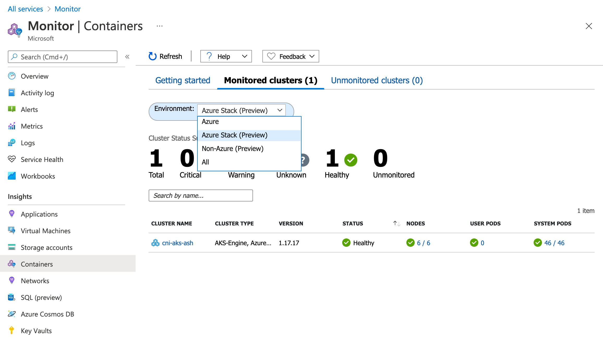
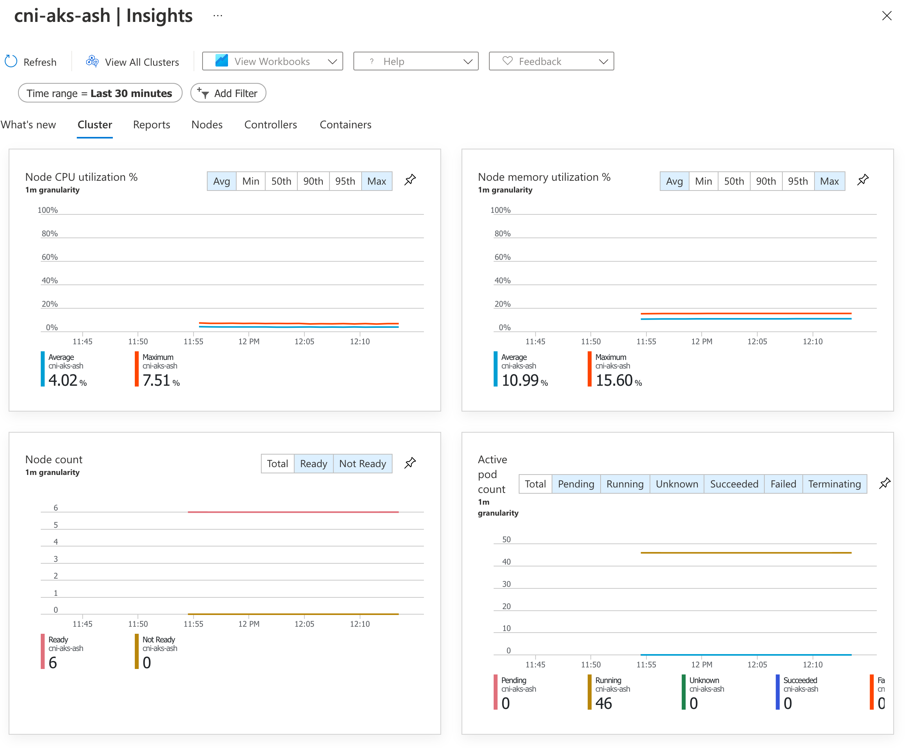

# Setting Up Container Insights

To deploy Azure Monitor for Containers we'll need to have a Log Analytics workspace to target which has the Container Insights solution installed. You can do this via your Azure Public Portal by do the following:

1. In the Azure Public Portal, click on 'Create a resource'
1. In the search type 'Log Analytics Workspace'
1. Click the 'Log Analytics Workspace' option in the search results
1. Click 'Create'
1. Enter values for 'Subscription', 'Resource Group', 'Name' and 'Region'
   > Note: To reduce latency on log writes you should keep the region as close as possible to your Azure Stack Hub instance location
1. Click 'Review & Create'  
1. Click 'Create'

After creating this we'll need to grab the workspace ID and Key which will be used in the Helm deployment. The following steps are based on the Azure guide located here:

* [Configure hybrid Kubernetes clusters with Azure Monitor for containers](https://docs.microsoft.com/en-us/azure/azure-monitor/insights/container-insights-hybrid-setup)

You'll need to follow the steps to enable the 'Container Insights' solution on the Log Analytics workspace. This is done via an Azure Resource Manager deployment, and the steps are available [here](https://docs.microsoft.com/en-us/azure/azure-monitor/containers/container-insights-hybrid-setup#how-to-add-the-azure-monitor-containers-solution). In short, you'll do the following:

1. Create a file containing the Azure Resource Manager template for the Container Insights solution. [Here](https://raw.githubusercontent.com/swgriffith/aks-on-stack/master/monitoring/deployment.json) is an example file.
1. Create a parameters file for the deployment. [Here](https://raw.githubusercontent.com/swgriffith/aks-on-stack/master/monitoring/deployment.parameters.json) is an example of that file.
1. Edit the parameters file to update the workspace resource ID and the workspace region.
   >Note: The resource ID is the fully qualified resource ID, which includes the subscription ID. You can get this in the portal by going to the Log Analytics workspace and clicking the 'Properties' pane.
1. Deploy the template via either Azure CLI or Azure Powershell
   ```bash
   RG=<Insert Log Analytics Workspace Resource Group Name>
   az deployment group create --resource-group $RG --name containerinsights --template-file  ./deployment.json --parameters @./deployment.parameters.json
   ```

Once you have your workspace, and you've enabled Container Insights, you need to grab the access key. You can get the access key either from the portal in the newly created Log Analytics resource, under 'Agents Management', or you can use the CLI as shown below.

```bash
# Get Access Key
az monitor log-analytics workspace get-shared-keys --resource-group $RG --workspace-name <INSERT WORKSPACE NAME>
```

Finally, we run the helm install. If you havent already installed Helm, you can find the instructions [here](https://helm.sh/docs/intro/install/).

```bash
# Add the helm repository
helm repo add microsoft https://microsoft.github.io/charts/repo

# Install the helm chart
LA_WORKSPACEID=<Insert Workspace ID>
LA_WORKSPACE_KEY=<Insert Workspace Shared Key>
CLUSTER_NAME=<Insert the cluster name>

helm install container-insights \
--set omsagent.secret.wsid=$LA_WORKSPACEID,omsagent.secret.key=$LA_WORKSPACE_KEY,omsagent.env.clusterName=$CLUSTER_NAME microsoft/azuremonitor-containers
```

Within a few minutes you should see the 'omsagent' pods in a running state in your kube-system namespace

```bash
kubectl get pods -n kube-system|grep oms

omsagent-8c9kq                                  1/1     Running   0          18m
omsagent-fxt5v                                  1/1     Running   0          18m
omsagent-g697c                                  1/1     Running   0          18m
omsagent-rdt9l                                  1/1     Running   0          18m
omsagent-rl5kr                                  1/1     Running   0          18m
omsagent-rs-5b5fdd4f7b-8vwhb                    1/1     Running   0          18m
omsagent-smxw8                                  1/1     Running   0          18m
```

To access Container Insights for your cluster in the Public Azure portal:

1. Go to 'All Services' and select 'Monitor'
2. In the monitor view click on 'Containers'
3. Click on the 'Monitored Clusters' tab
4. In the 'Environment' filter, choose 'Azure Stack (Preview)'
5. Click on your cluster name
   

You should now be able to explore your cluster in Container Insights!



---

* [Back to Monitoring](./monitoring.md)
* [Table of Contents](./README.md)