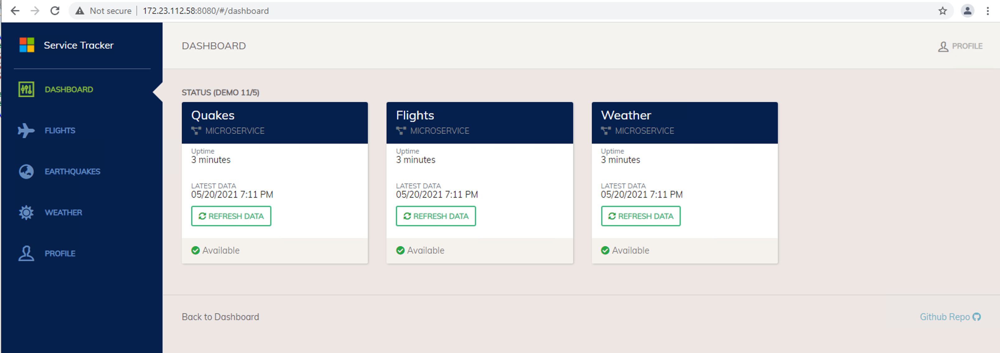

# Deploy the cluster!

The first thing you'll need, now that you have AKS Engine installed on a jump box, is an AKS Engine Cluster Specification (aka. API Model). The cluster specification is a file that we use to tell AKS engine how we want the cluster to be configured, including key options like the following:

* Kubernetes Version
* Cluster OS
* Control Plane Node Count
* Worker Node Count
* Network Plugin
* Network Policy

>**_IMPORTANT:_** The cluster specification is initially used for creating the cluster, but a new cluster specification file is created for you as an output of the cluster creation process. THIS is the file you should use for future cluster operations, like upgrade and scale operations.

The Azure Stack team maintains an example cluster specification in the AKS Engine Git Repo. Make sure you select the appropriate branch for your version of AKS Engine, and then go to 'examples/azure-stack'.

* [AKS Engine on ASH Deployment Guide](https://docs.microsoft.com/en-us/azure-stack/user/azure-stack-kubernetes-aks-engine-deploy-cluster?view=azs-2008)
* [AKS Engine v0.60.1 on ASH Sample Cluster Specification](https://github.com/Azure/aks-engine/blob/patch-release-v0.60.1/examples/azure-stack/kubernetes-azurestack.json)

Once you've downloaded your relevant cluster specification file, continue following the above referenced AKS on ASH deployment guide to update the file with relevant parameters, which includes the following:

* ASH Portal Fully Qualified Domain Name
* Cluster Version and Size Details
* Master and Worker Vnet/Subnet Resource IDs
* Master First Consecutive IP
* Service Principal ID and Secret
  
```bash
# Load some environment variables to be used in the deployment
RG=<Target Resource Group Name>
LOC=<Azure Stack Hub Target Instance>
CLIENT_ID=<Service Principal Client ID>
CLIENT_SECRET=<Service Principal Client Secret>
SUB_ID=<Subscription ID>

# Deploy the cluster
# Note that I use the resource group name
# for the output directory. 
aks-engine deploy \
--azure-env AzureStackCloud \
--location $LOC \
--resource-group $RG \
--api-model ./kubernetes-azurestack.json \
--output-directory $RG \
--client-id $CLIENT_ID \
--client-secret $CLIENT_SECRET \
--subscription-id $SUB_ID
```

The above deploy command will create an output directory containing the following:

* **_apimodel.json_** - This API model represents the current state of the cluster and should be used for all future operations against the cluster
* **_azuredeploy.json_** - This is an Azure Resource Manager template used to create the Azure resources
* **_azuredeploy.parameters.json_** - Parameters file for the above noted Azure deployment template
* **_kubeconfig directory_** - This directory holds your Kubernetes config file which can be used to access the cluster via [kubectl](https://kubernetes.io/docs/reference/kubectl/overview/)
* Various certificate files that were created as part of the cluster creation process

To access your cluster:

1. Install [kubectl](https://kubernetes.io/docs/tasks/tools/)
1. Tell kubectl where your config file is:
  
   * Option 1: Copy the kubeconfig json document to ~/.kube/config (the default location for Kubernetes config files)
        ```bash
        cp <aks engine output directory>/kubeconfig/<configfilename>.json ~/.kube/config
        ```
   * Option 2: Use the KUBECONFIG environment variable to tell kubectl where the file is
        ```bash
        export KUBECONFIG=<aks engine output directory>/kubeconfig/<configfilename>.json
        ```
   * Option 3: Merge your new file into an existing config file, although I've found this to be a bit inconsistent
        ```bash
        # Add all of the config files to the KUBECONFIG path
        export KUBECONFIG=~/<path to config file 1>/<filename>.json:~/<path to config file 2>/<filename>.json
        # Use the config view tool with the flatten option to merge and output to a single file
        kubectl config view --merge --flatten > ~/.kube/config
        # Now we reset the KUBECONFIG environment variable to the default path
        export KUBECONFIG=~/.kube/config
        ```
        >Note: The above approach may not work if one config file is yaml and the other is json. 

1. Call the cluster
   ```bash
    $ kubectl cluster-info

    Kubernetes control plane is running at https://cni-aks-ash.3173r03a.cloudapp.azcatcpec.com
    CoreDNS is running at https://cni-aks-ash.3173r03a.cloudapp.azcatcpec.com/api/v1/namespaces/kube-system/services/kube-dns:dns/proxy
    Metrics-server is running at https://cni-aks-ash.3173r03a.cloudapp.azcatcpec.com/api/v1/namespaces/kube-system/services/https:metrics-server:/proxy

    $ kubectl get nodes

    NAME                       STATUS   ROLES    AGE   VERSION
    k8s-linuxpool-70281987-0   Ready    agent    18h   v1.17.17
    k8s-linuxpool-70281987-1   Ready    agent    18h   v1.17.17
    k8s-linuxpool-70281987-2   Ready    agent    18h   v1.17.17
    k8s-master-70281987-0      Ready    master   18h   v1.17.17
    k8s-master-70281987-1      Ready    master   18h   v1.17.17
    k8s-master-70281987-2      Ready    master   18h   v1.17.17
   ```

1. Install a sample application

```bash
# Clone this repository
git clone https://github.com/swgriffith/aks-on-stack.git
cd aks-on-stack

# Deploy the namespace and application components
kubectl apply -f sample-app/namespace.yaml
kubectl apply -f sample-app/mongodb.yaml
kubectl apply -f sample-app/data-api.yaml
kubectl apply -f sample-app/flights-api.yaml
kubectl apply -f sample-app/quakes-api.yaml
kubectl apply -f sample-app/weather-api.yaml
kubectl apply -f sample-app/service-tracker-ui.yaml

# Watch the services and pods come online
watch kubectl get svc,pods -o wide -n service-tracker

# Once the 'EXTERNAL-IP' field is populated for the service-tracker-ui
# copy the IP and open your browser to http://<EXTERNAL-IP>:8080
# Click the 'Refresh Data' links to load the dashboard
```


---

* [Table of Contents](./README.md)