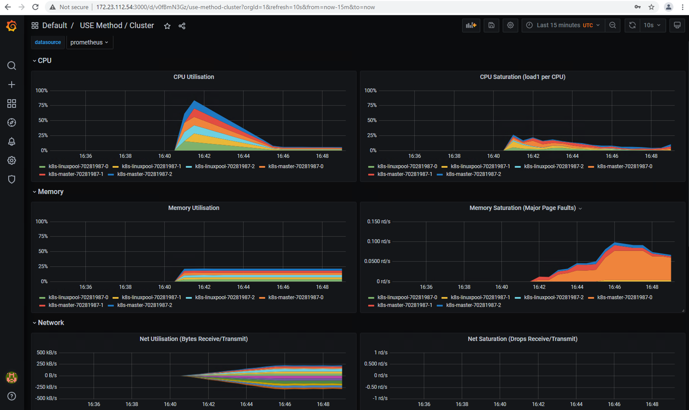

# Setting Up Kube-Prometheus

As mentioned previously, there are various approaches for enabling Kubernetes monitoring with Prometheus. For this walkthrough I will use the [kube-prometheus](https://github.com/prometheus-operator/kube-prometheus) project, as I find it to be the most active and has all of the moving parts wired up very well.

The first thing you'll need to do is clone the kube-prometheus repository.
```bash
git clone https://github.com/prometheus-operator/kube-prometheus
```
Next, you'll install the CRDs, namespace and the prometheus operator. 
>Note: At this point you may choose to make some changes to things like the namespace. The best practices from the kube-prometheus project is to use their jssonet config generation approach. You can find the details [here](https://github.com/prometheus-operator/kube-prometheus#customizing-kube-prometheus)

```bash
cd kube-prometheus
```

There are two options for how you connect to the dashboards. 
1. Leave the default configuration, which does not expose a Azure Stack Hub IP via an Azure Load Balancer. This option requires you to use 'kubectl port-forward' to create a forwarding port from your localhost to the cluster.
2. Edit any of the <component>-service.yaml files and add the 'type: LoadBalancer' service option, which will tell Kubernetes to provision a load balancer for the endpoint.

ex. grafana-service.yaml
```yaml
apiVersion: v1
kind: Service
metadata:
  labels:
    app.kubernetes.io/component: grafana
    app.kubernetes.io/name: grafana
    app.kubernetes.io/part-of: kube-prometheus
    app.kubernetes.io/version: 7.5.4
  name: grafana
  namespace: monitoring
spec:
  type: LoadBalancer
  ports:
  - name: http
    port: 3000
    targetPort: http
  selector:
    app.kubernetes.io/component: grafana
    app.kubernetes.io/name: grafana
    app.kubernetes.io/part-of: kube-prometheus
```

```bash
# Create the namespace and CRDs, and then wait for them to be available before creating the remaining resources
kubectl create -f manifests/setup
until kubectl get servicemonitors --all-namespaces ; do date; sleep 1; echo ""; done
kubectl create -f manifests/

# Watch the services and pods deploy
watch kubectl get svc,pods -n monitoring
```

Once everything is running you can connect to the cluster by using a kubectl port-forward (ex. ```kubectl port-foward svc/grafana 3000:3000```), or if you didn't edit the file to set the type to LoadBalancer, you can just get the External-IP value and go right to your browser.

ex. Port Forward
```bash
kubectl port-forward svc/grafana -n monitoring 3000:3000
Forwarding from 127.0.0.1:3000 -> 3000
Forwarding from [::1]:3000 -> 3000

# Open your browser to http://localhost:3000
```

ex. Service type set to Load Balancer for grafana
```bash
kubectl get svc -n monitoring
NAME                    TYPE           CLUSTER-IP     EXTERNAL-IP     PORT(S)                      AGE
alertmanager-main       ClusterIP      10.0.176.188   <none>          9093/TCP                     4m31s
alertmanager-operated   ClusterIP      None           <none>          9093/TCP,9094/TCP,9094/UDP   4m31s
blackbox-exporter       ClusterIP      10.0.197.201   <none>          9115/TCP,19115/TCP           4m30s
grafana                 LoadBalancer   10.0.59.223    172.23.112.54   3000:32638/TCP               4m30s
kube-state-metrics      ClusterIP      None           <none>          8443/TCP,9443/TCP            4m30s
node-exporter           ClusterIP      None           <none>          9100/TCP                     4m30s
prometheus-adapter      ClusterIP      10.0.62.220    <none>          443/TCP                      4m29s
prometheus-k8s          ClusterIP      10.0.248.220   <none>          9090/TCP                     4m29s
prometheus-operated     ClusterIP      None           <none>          9090/TCP                     4m29s
prometheus-operator     ClusterIP      None           <none>          8443/TCP                     11m

# Open your browser to http://172.23.112.54:3000
```

>**_NOTE:_** The default user ID and password is admin:admin. You'll be prompted to enter a new admin password after initial login. This can also be set in advance by modifying the manifest files. See the kube-prometheus documentation for more details.

You should now be able to navigate around the grafana installed dashboards for Kubernetes and should see live data.



--- 
