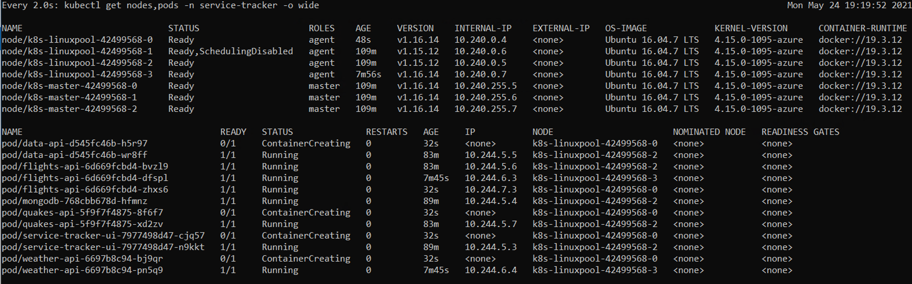
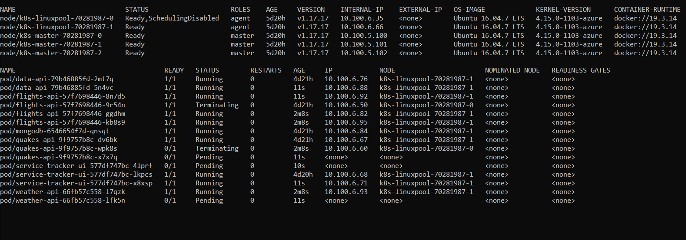

# Upgrade Walkthrough

In this walkthrough we'll show the process for upgrading an AKS Engine cluster on Azure Stack Hub, starting with an AKS Engine upgrade.

Our starting cluster will be the following:
* AKS Engine: v0.55.4
* Kubernetes: v1.15.12
* OS: Ubuntu 16.04.7 LTS   4.15.0-1095-azure

## Deploy Sample Cluster

First lets create our sample cluster.

```bash
# Install the proper version of AKS Engine
curl -o get-akse.sh https://raw.githubusercontent.com/Azure/aks-engine/master/scripts/get-akse.sh
chmod 700 get-akse.sh
./get-akse.sh --version v0.55.4

# Check your version
aks-engine version

Version: v0.55.4
GitCommit: 0b2df8a7a
GitTreeState: clean
```

Next we pull down a matching sample api model file.

```bash
# Download the file locally
wget https://raw.githubusercontent.com/Azure/aks-engine/v0.55.0/examples/azure-stack/kubernetes-azurestack.json

# Edit to update with your location, portal URL, cluster dns name, ssh key and client credentials
nano kubernetes-azurestack.json
```

Deploy the cluster.

```bash
aks-engine deploy \
--azure-env AzureStackCloud \
--location <Insert Location ID> \
--resource-group <Insert Target Resource Group> \
--api-model ./kubernetes-azurestack.json \
--output-directory <Output Directory Name> \
--client-id "<Insert Client ID>" \
--client-secret "<Insert Client Secret>" \
--subscription-id "<Insert Target Subscription ID>"

# Once deployed, check the version
kubectl get nodes -o wide

NAME                       STATUS   ROLES    AGE   VERSION    INTERNAL-IP    EXTERNAL-IP   OS-IMAGE             KERNEL-VERSION      CONTAINER-RUNTIME
k8s-linuxpool-42499568-0   Ready    agent    35m   v1.15.12   10.240.0.4     <none>        Ubuntu 16.04.7 LTS   4.15.0-1095-azure   docker://19.3.12
k8s-linuxpool-42499568-1   Ready    agent    35m   v1.15.12   10.240.0.6     <none>        Ubuntu 16.04.7 LTS   4.15.0-1095-azure   docker://19.3.12
k8s-linuxpool-42499568-2   Ready    agent    35m   v1.15.12   10.240.0.5     <none>        Ubuntu 16.04.7 LTS   4.15.0-1095-azure   docker://19.3.12
k8s-master-42499568-0      Ready    master   36m   v1.15.12   10.240.255.5   <none>        Ubuntu 16.04.7 LTS   4.15.0-1095-azure   docker://19.3.12
k8s-master-42499568-1      Ready    master   35m   v1.15.12   10.240.255.6   <none>        Ubuntu 16.04.7 LTS   4.15.0-1095-azure   docker://19.3.12
k8s-master-42499568-2      Ready    master   35m   v1.15.12   10.240.255.7   <none>        Ubuntu 16.04.7 LTS   4.15.0-1095-azure   docker://19.3.12
```

Let's also deploy a sample app we can watch during the upgrade process:

```bash
# Clone this repository
git clone https://github.com/swgriffith/aks-on-stack.git
cd aks-on-stack

# Deploy the namespace and application components
kubectl apply -f sample-app/namespace.yaml
kubectl apply -f sample-app/mongodb.yaml
kubectl apply -f sample-app/data-api.yaml
kubectl apply -f sample-app/flights-api.yaml
kubectl apply -f sample-app/quakes-api.yaml
kubectl apply -f sample-app/weather-api.yaml
kubectl apply -f sample-app/service-tracker-ui.yaml

# Watch the services and pods come online
watch kubectl get svc,pods -o wide -n service-tracker

# Once the 'EXTERNAL-IP' field is populated for the service-tracker-ui
# copy the IP and open your browser to http://<EXTERNAL-IP>:8080
# Click the 'Refresh Data' links to load the dashboard
```

---

## Review our options

We want to upgrade in a way that has minimal impact to our application and runtime, so before we do anything we need to understand the upgrade options we have from the following:

* AKS Engine: v0.55.4
* Kubernetes: v1.15.12
* OS: Ubuntu 16.04.7 LTS   4.15.0-1095-azure

Checking the AKS Engine on Azure Stack Hub [release notes](https://docs.microsoft.com/en-us/azure-stack/user/kubernetes-aks-engine-release-notes?view=azs-2102#aks-engine-and-corresponding-image-mapping) we can see that the next supported version of AKS Engine is v0.60.1....but that version does not support Kubernetes 1.15. So, before we can upgrade AKS Engine versions to take adavantage of new OS images and Azure features, we need to get up to a supported Kubernetes version.

Let's see what options we have:

```bash
# Use the aks-engine get-versions command to see what we can upgrade to
aks-engine get-versions --version 1.15.12
Version Upgrades
1.15.12 1.16.13, 1.16.14
```

Great, we can go from our current version up to 1.16.14, which will get us into the Kubernetes minor release of 1.16, and that version is supported by AKS Engine v0.60.1.

## Initial Kubernetes Upgrade

We'll use the aks-engine upgrade command to bump our Kubernetes version from 1.15.12 to 1.16.14. While we're at it, we can watch the application we deployed to see how it behaves. 

Open up two terminal windows.

Terminal 1
```bash
# Watch your application pods
# Note that we have two pods for each service, except the mongo DB
watch kubectl get nodes,pods -n service-tracker -o wide

NAME                            STATUS   ROLES    AGE   VERSION    INTERNAL-IP    EXTERNAL-IP   OS-IMAGE             KERNEL-VERSION      CONTAINER-RUNTIME
node/k8s-linuxpool-42499568-0   Ready    agent    77m   v1.15.12   10.240.0.4     <none>        Ubuntu 16.04.7 LTS   4.15.0-1095-azure   docker://19.3.12
node/k8s-linuxpool-42499568-1   Ready    agent    77m   v1.15.12   10.240.0.6     <none>        Ubuntu 16.04.7 LTS   4.15.0-1095-azure   docker://19.3.12
node/k8s-linuxpool-42499568-2   Ready    agent    77m   v1.15.12   10.240.0.5     <none>        Ubuntu 16.04.7 LTS   4.15.0-1095-azure   docker://19.3.12
node/k8s-master-42499568-0      Ready    master   77m   v1.15.12   10.240.255.5   <none>        Ubuntu 16.04.7 LTS   4.15.0-1095-azure   docker://19.3.12
node/k8s-master-42499568-1      Ready    master   77m   v1.15.12   10.240.255.6   <none>        Ubuntu 16.04.7 LTS   4.15.0-1095-azure   docker://19.3.12
node/k8s-master-42499568-2      Ready    master   77m   v1.15.12   10.240.255.7   <none>        Ubuntu 16.04.7 LTS   4.15.0-1095-azure   docker://19.3.12

NAME                                      READY   STATUS    RESTARTS   AGE   IP           NODE                       NOMINATED NODE   READINESS GATES
pod/data-api-d545fc46b-4jdd5              1/1     Running   1          57m   10.244.4.3   k8s-linuxpool-42499568-1   <none>           <none>
pod/data-api-d545fc46b-wr8ff              1/1     Running   0          51m   10.244.5.5   k8s-linuxpool-42499568-2   <none>           <none>
pod/flights-api-6d669fcbd4-6brqz          1/1     Running   0          57m   10.244.3.4   k8s-linuxpool-42499568-0   <none>           <none>
pod/flights-api-6d669fcbd4-bvzl9          1/1     Running   0          51m   10.244.5.6   k8s-linuxpool-42499568-2   <none>           <none>
pod/flights-api-6d669fcbd4-f44hn          1/1     Running   0          51m   10.244.4.4   k8s-linuxpool-42499568-1   <none>           <none>
pod/mongodb-768cbb678d-hfmnz              1/1     Running   0          57m   10.244.5.4   k8s-linuxpool-42499568-2   <none>           <none>
pod/quakes-api-5f9f7f4875-lxnw6           1/1     Running   0          57m   10.244.3.3   k8s-linuxpool-42499568-0   <none>           <none>
pod/quakes-api-5f9f7f4875-xd2zv           1/1     Running   0          51m   10.244.5.7   k8s-linuxpool-42499568-2   <none>           <none>
pod/service-tracker-ui-7977498d47-d72ms   1/1     Running   0          51m   10.244.4.5   k8s-linuxpool-42499568-1   <none>           <none>
pod/service-tracker-ui-7977498d47-n9kkt   1/1     Running   0          57m   10.244.5.3   k8s-linuxpool-42499568-2   <none>           <none>
pod/weather-api-6697b8c94-6fqg8           1/1     Running   0          51m   10.244.3.5   k8s-linuxpool-42499568-0   <none>           <none>
pod/weather-api-6697b8c94-vgxvc           1/1     Running   0          57m   10.244.4.2   k8s-linuxpool-42499568-1   <none>           <none>
```

Terminal 2
```bash
# Upgrade your Kubernetes Version
aks-engine upgrade \
--azure-env AzureStackCloud \
--location <Insert Location ID> \
--resource-group <Insert Target Resource Group> \
--api-model <Insert Path to generated apimodel.json file> \
--client-id "<Insert Client ID>" \
--client-secret "<Insert Client Secret>" \
--subscription-id "<Insert Target Subscription ID>" \
--upgrade-version 1.16.14
```

The upgrade will take a while, as each node is individually upgraded. Keep an eye on the 'watch' running in terminal 1, and you'll start to see nodes moved to 'Not Ready' state and then the node Kubernetes version will switch over to 1.16.14 and the node will be in 'Ready' state again. If you watch the output of aks-engine, you'll see your node count increased by 1 each time a node is upgraded. AKS Engine will add a node to the cluster, get it online, and then remove the old node.

You should also see your application pods coming off and online, but since our deployment as two replicas of each application component, with the exception of MongoDB, there shouldn't be any service interuption until the stateful workloads transition. This is why it's so important to consider the persistence layer of your application, and either move out of cluster, or to a solution in cluster that will manage your trasnsition during upgrades (ex. The [MongoDB Operator](https://docs.mongodb.com/kubernetes-operator/master/))



Also, as you can see below, in the load test run during the upgrade, out of 1 million requests, we had 39 failed due to timeout. This, as mentioned above, was almost certainly when our single MongoDB pod was moved.

```bash
Status code distribution:
  [200] 1000000 responses

Error distribution:
  [39]  Get "http://172.23.112.57:8080/#/weather": context deadline exceeded (Client.Timeout exceeded while awaiting headers)
```

--- 

## Upgrade AKS Engine

First let's upgrade the AKS Engine version. After checking the docs, we see that the most recent supported version for Azure Stack Hub [documented here](https://docs.microsoft.com/en-us/azure-stack/user/kubernetes-aks-engine-release-notes?view=azs-2102#aks-engine-and-corresponding-image-mapping) is **v0.60.1**, so let's pull that version down.

```bash
# Upgrade AKS Engine versions
curl -o get-akse.sh https://raw.githubusercontent.com/Azure/aks-engine/master/scripts/get-akse.sh
chmod 700 get-akse.sh
./get-akse.sh --version v0.60.1

# Check your version
aks-engine version

Version: v0.60.1
GitCommit: 91d42f2ba
GitTreeState: clean
```

---
## Upgrade Node OS to Lastest 16.04 Base Image

Looking at the [release motes](https://docs.microsoft.com/en-us/azure-stack/user/kubernetes-aks-engine-release-notes?view=azs-2102#aks-engine-and-corresponding-image-mapping) for AKS Engine v0.60.1, we can see that the has been an OS Image update (Ubuntu 16.04 2020.09.14 to Ubuntu 16.04 2021.01.28). Let's upgrade our cluster to that updated image.

If you're only upgrading the OS image, you can run the exact same command we ran to upgrade our Kubernetes version, but include the --force flag.

```bash
# Upgrade your Cluster OS Version
aks-engine upgrade \
--azure-env AzureStackCloud \
--location <Insert Location ID> \
--resource-group <Insert Target Resource Group> \
--api-model <Insert Path to generated apimodel.json file> \
--client-id "<Insert Client ID>" \
--client-secret "<Insert Client Secret>" \
--subscription-id "<Insert Target Subscription ID>" \
--upgrade-version 1.16.14 \
--force
```

Just like above, we can watch the status of the upgrade as follows via ```watch kubectl get nodes,pods -n service-tracker -o wide```. We'll see the nodes iterate through an upgrade, one by one, and if the application is running in a deployment with replica sets, we should only see a subset of the active pods in a deployment impacted at any given time, so there shouldn't be any downtime.

---
## Upgrade to New OS Major Version

Over time new versions of the base OS will be available. Thus far our cluster has been running on Ubuntu 16.04, but 18.04 is available per the [ASH Release Notes](https://docs.microsoft.com/en-us/azure-stack/user/kubernetes-aks-engine-release-notes?view=azs-2102#aks-engine-and-corresponding-image-mapping). To upgrade the OS version, we simply need to set that OS version in the apimodel.json file, and again run the upgrade command from above with the '--force' flag.

```bash
# Edit the apimodel.json to set the image version from 16.04 to 18.04
# You should update for both the 'masterProfile' and the 'agentpoolProfile'
nano <output directory>/apimodel.json

# Check the edits where made
cat griffith-engine-upgrade/apimodel.json |grep distro

      "distro": "aks-ubuntu-18.04",
        "distro": "aks-ubuntu-18.04",

# Run the upgrade command
aks-engine upgrade \
--azure-env AzureStackCloud \
--location <Insert Location ID> \
--resource-group <Insert Target Resource Group> \
--api-model <Insert Path to generated apimodel.json file> \
--client-id "<Insert Client ID>" \
--client-secret "<Insert Client Secret>" \
--subscription-id "<Insert Target Subscription ID>" \
--upgrade-version 1.16.14 \
--force
```

---

## OS Patching and Reboot with Kured

AKS nodes are pre-configured with [Unattended Upgrades](https://wiki.debian.org/UnattendedUpgrades), so any patches that need to be applied will be done so automatically. However, many patches require a reboot. A required reboot is signaled by the file ```/var/run/reboot-required```. 

```bash
cat /var/run/reboot-required

*** System restart required ***
```

You can watch for this file yourself and reboot manually, draining and cordoning each node, or you can use the **KU**bernetes **RE**boot **D**aemon (aka. [Kured](https://github.com/weaveworks/kured)). You can review all of the Kured config options on the Kured site. This includes [setting a schedule](https://github.com/weaveworks/kured#setting-a-schedule) and setting up [notifications](https://github.com/weaveworks/kured#notifications), but for this walkthrough we'll just do a vanilla installation.

> **_NOTE:_** I've found that the latest version of the kured yaml file is missing the 'args:' section under the 'command:' block. args is where you set any custom configs like ```--period```. You will need to add this back in to look like the following:

```yaml
    command:
    - /usr/bin/kured
    args:
    - --period=1m
```

Lets pull down the latest, edit and apply.

```bash
latest=$(curl -s https://api.github.com/repos/weaveworks/kured/releases | jq -r .[0].tag_name)
wget "https://github.com/weaveworks/kured/releases/download/$latest/kured-$latest-dockerhub.yaml"

# Optionally edit the config. I'm going to set the period to every 1 minute for demo only.
nano kured-$latest-dockerhub.yaml

# Check the deployment
 kubectl get pods -n kube-system -o wide |grep kured

kured-kh9fv                                     1/1     Running   0          65s     10.100.6.46    k8s-linuxpool-70281987-0   <none>           <none>
kured-wrgm2                                     1/1     Running   0          65s     10.100.6.82    k8s-linuxpool-70281987-1   <none>           <none>
```

You can watch the logs with the following command:

```bash
kubectl logs -l name=kured -n kube-system -f
...
time="2021-05-25T16:26:23Z" level=info msg="Reboot required"
time="2021-05-25T16:26:23Z" level=warning msg="Lock already held: k8s-linuxpool-70281987-0"
```

You may run into some errors for pods that cannot be deleted, and will need to decide if you should update the [pod disruption budget](https://kubernetes.io/docs/tasks/run-application/configure-pdb/), or implement ```--force-reboot=true```.

```bash
evicting pod monitoring/alertmanager-main-0
error when evicting pods/"alertmanager-main-0" -n "monitoring" (will retry after 5s): Cannot evict pod as it would violate the pod's disruption budget.
```

As you'll see, the nodes are cordoned, drained and rebooted one by one, so there should be minimal impact to an application designed to be distributed across the cluster.



After the reboot is complete, if you check a node for the existence of ```/var/run/reboot-required``` you'll see that the file is now gone.

---
* [Back to Upgrade Overview](./upgrade-overview.md)
* [Table of Contents](./README.md)